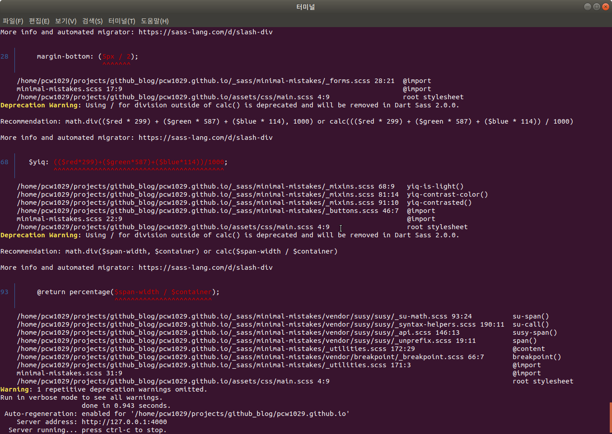
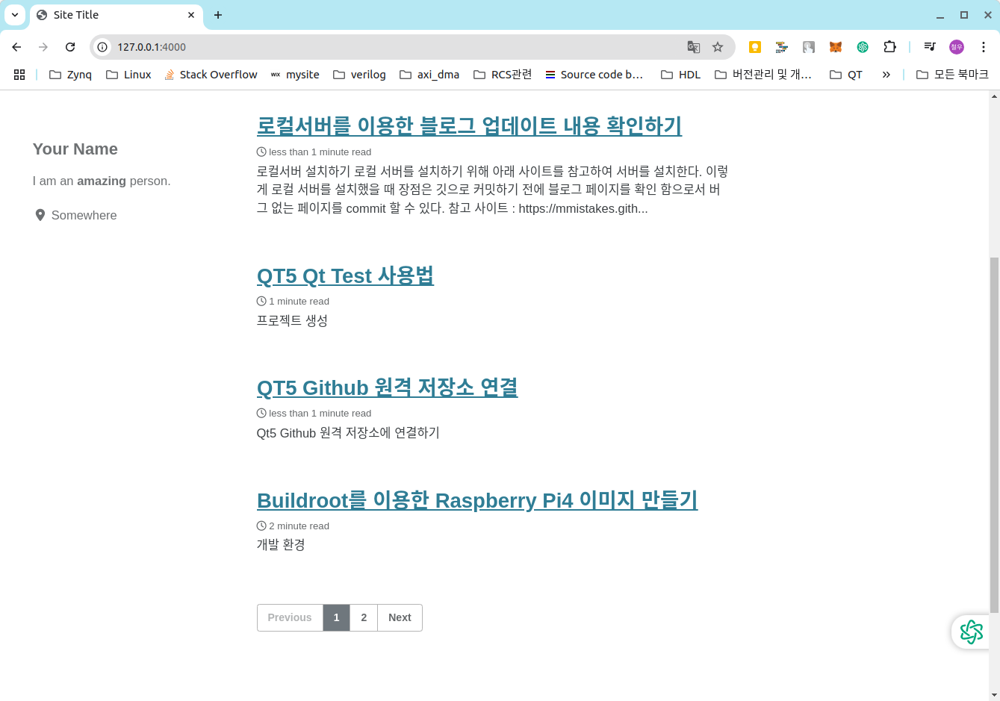
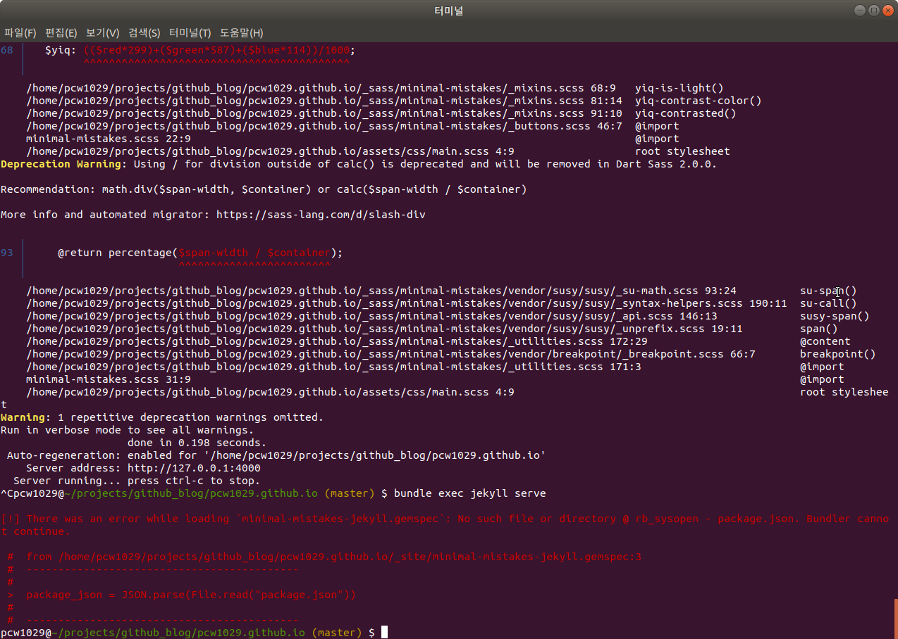
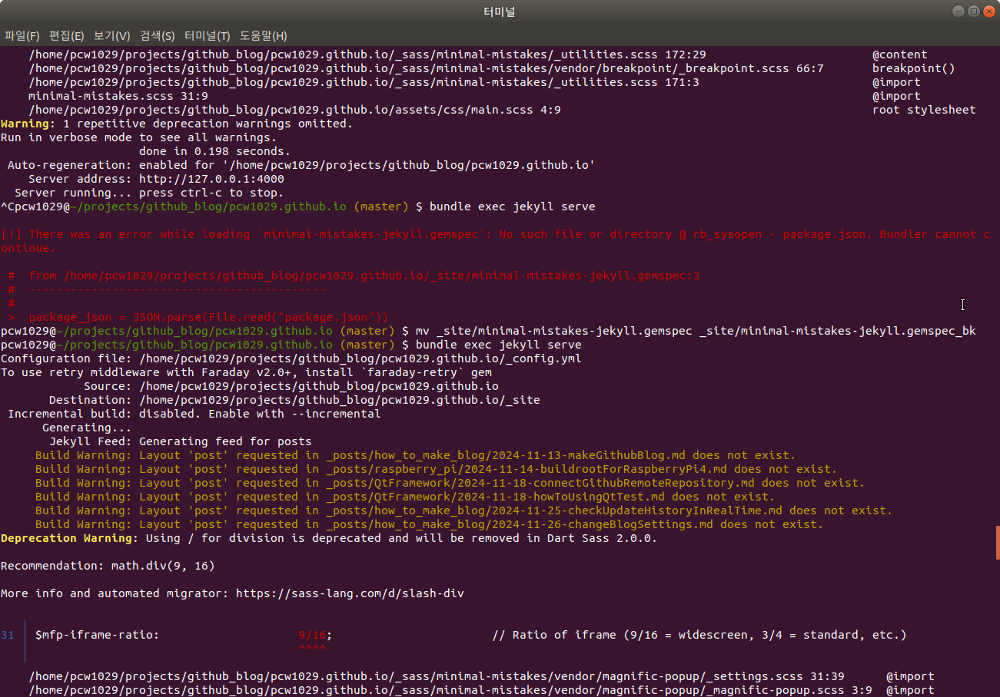

# 로컬서버 설치하기
로컬 서버를 설치하기 위해 아래 사이트를 참고하여 서버를 설치한다. 

이렇게 로컬 서버를 설치했을 때 장점은 Github로 Commit 전 블로그 페이지를 확인 함으로서 설정 변경 및 버그를 줄일 수 있다. 

Desktop의 OS는 Ubuntu 18.04 이다.

참고 사이트 : https://mmistakes.github.io/minimal-mistakes/docs/quick-start-guide/
참고 사이트 : https://jekyllrb.com/docs/


# 루비 설치 하기 

1. **패키지 목록 업데이트 및 의존성 설치**: 먼저 필요한 의존성을 설치합니다.

   ```bash
   $ sudo apt update
   $ sudo apt install -y curl gpg2 gnupg
   ```

   

2. **GPG 키 가져오기**: RVM 설치를 위해 GPG 키를 추가합니다.

   ```bash
   $ gpg --keyserver hkp://keyserver.ubuntu.com:80 --recv-keys 409B6B1796C275462A1703113804BB82D39DC0E3 7D2BAF1CF37B13E2069D6956105BD0E739499BDB
   ```

   

3. **RVM 설치**: `curl`을 사용하여 RVM을 설치합니다.

   ```bash
   $ \curl -sSL https://get.rvm.io | bash -s stable
   ```

   

4. **RVM 활성화**: 설치가 끝나면 RVM을 사용할 수 있도록 초기화합니다. 이 명령어를 터미널에서 실행하거나, `.bashrc` 파일에 추가해 줍니다.

   ```bash
   $ source ~/.rvm/scripts/rvm
   ```

   터미널을 열 때 마나 위 명령을 매번 해줘야 하는데 .bashrc 마지막 줄에 위 명령을 추가해주면  터미널을 새로 열 때 위 명령을 생략해도 된다. 

   

5. **RVM을 사용해 Ruby 설치**: RVM을 이용해 Ruby 3.0을 설치합니다.

   ```bash
   $ rvm install 3.0
   ```

   

6. **기본 Ruby 버전 설정**: 설치 후 기본 Ruby 버전으로 설정합니다.

   ```bash
   $ rvm use 3.0 --default
   ```

   

7. **설치 확인**: Ruby가 잘 설치되었는지 확인합니다.

   ```bash
   $ ruby -v
   ```


# jekyll 설치

터미널창에서 아래 명령을 실행하여 jekyll을 설치해준다.

```bash
$ gem install jekyll

$ gem install bundler
```

github blog 폴더로 이동하여 작업한다.

```bash
$ cd pcw1029.github.io
$ bundle install
$ bundle exec jekyll serve
```




여기까지 정상적으로 완료되면 내 컴퓨터에서 웹사이트를 띄울 수 있다. 



***서버를 종료했다 다시 실행 할 때 아래와 같은 오류가 나타나면 해당 파일을 삭제하거나 이름을 바꾼 후 다시 실행하면 정상 동작한다.***




