1. 프로젝트 생성

   1. Qt Test를 하기위한 프로젝트를 생성하기 위해 Qt Creator를 열고 New를 선택한다. 

   2. New Project - Qt Creator 창이 출력되면 Other Project에서 Subdirs Project를 선택한다.

      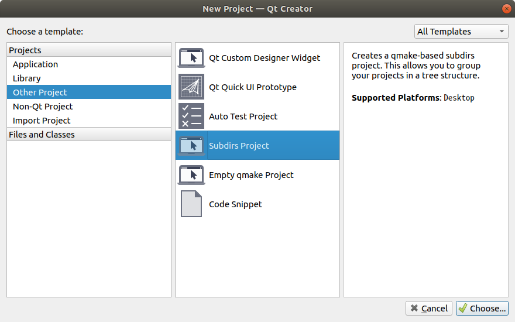

      

   3. 프로젝트 생성 폴더를 지정하고 Next를 클릭한다.

      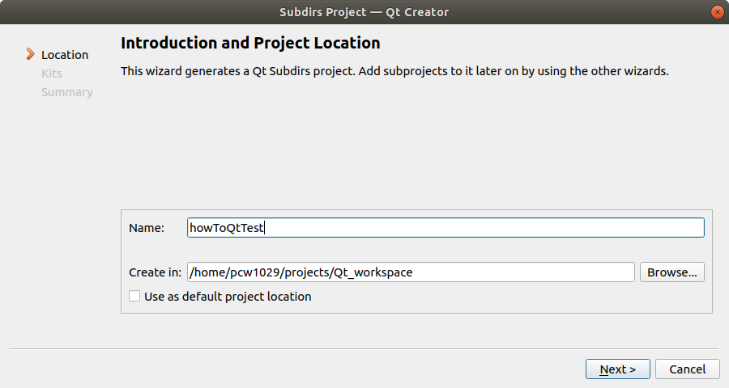

      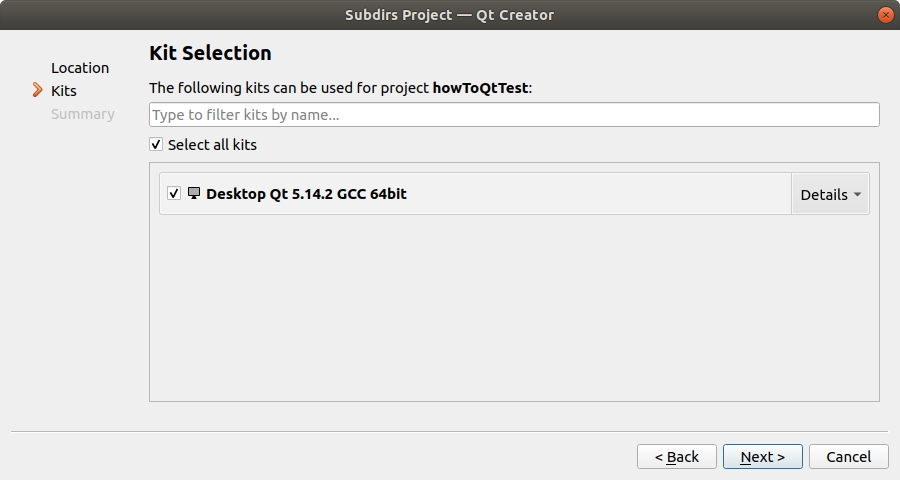

      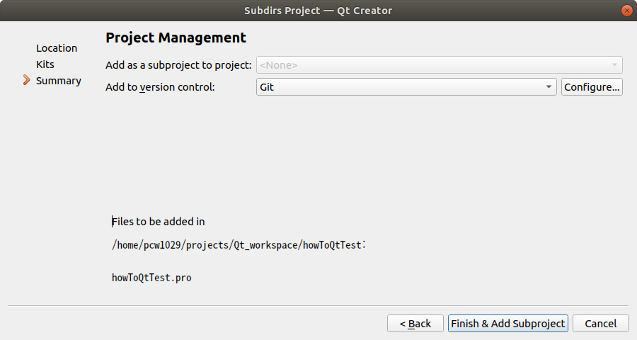

      

   4. Finish & Add Subproject를 클릭하면 처음 프로젝트 생성 화면이 아래와 같은 출력된다. Application의 Qt Console Application을 선택하겠다. 물론 Widgets을 사용해도 되지만 간단한 테스트를 목적으로 하고있기 때문에 콘솔 어플리케이션을 선택했다.

      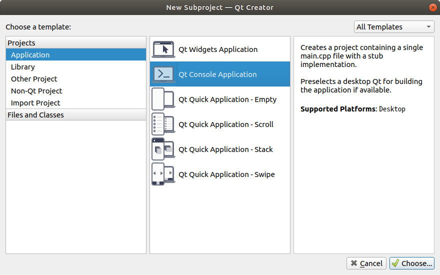

      

   5. 이후 프로젝트 생성 방법은 동일하기 때문에 Skip한다.

      프로젝트 생성을 마쳤으면 아래 그림과 같이 콘솔용 어플리케이션 프로젝트가 howToQtTest란 폴더 아래 존재하는것을 볼수 있을것이다.

   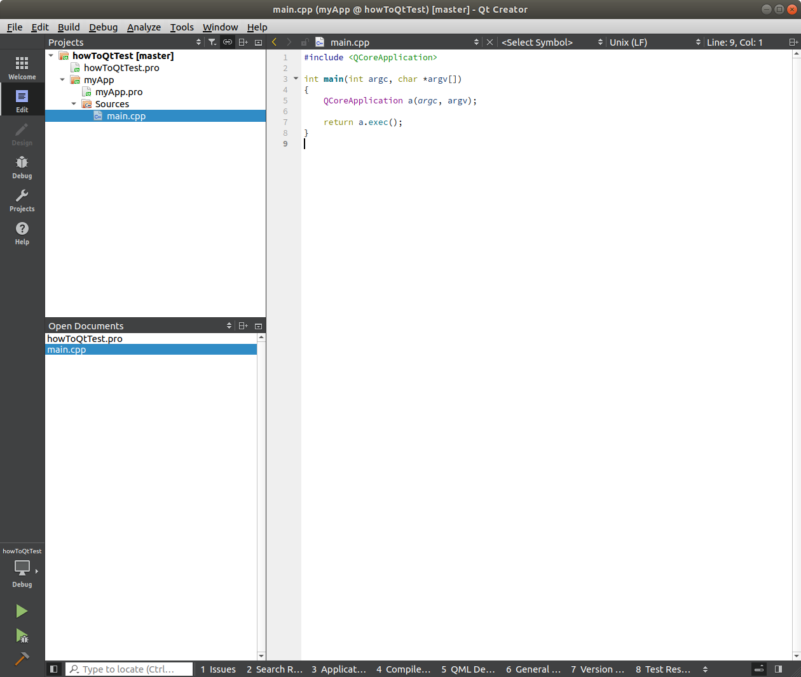

   

2. Qt Test 프로젝트 생성

   1. howToQtTest폴더에서 마우스 우측버튼을 클릭하여 New Subproject...를 선택하면 아래 그림과 같이 New Subproject - Qt Creator 창이 출력된다. 여기서 Auto Test Project를 선택한다.

      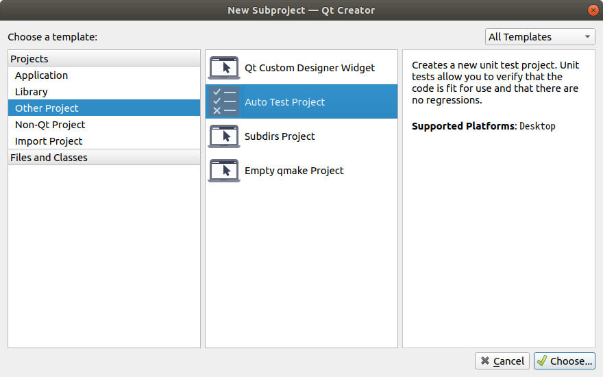

      

   2. 프로젝트 이름을 설정 후 Next를 클릭한다.

      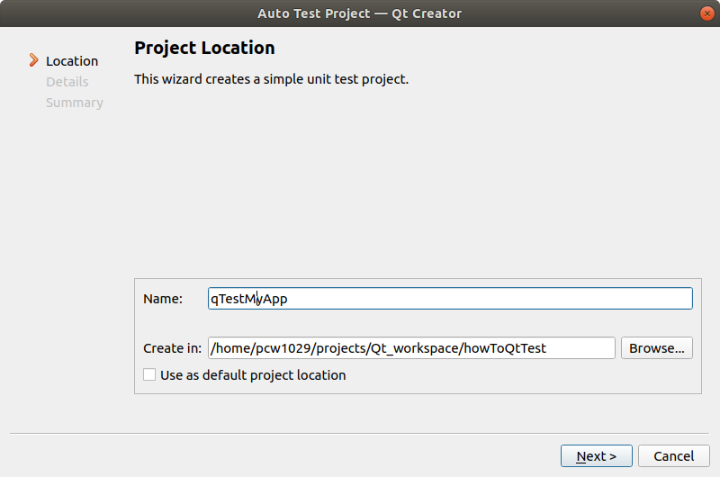

      

   3. Test Case name을 입력하고 Next를 클릭한다.

      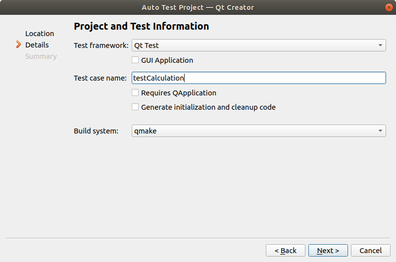

      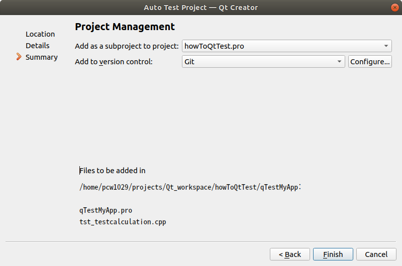

      

   4. Finish를 클릭하면 아래 그림과 같이 howToQtTest란 폴더안에 이전에 생성했던 콘솔 어플리케이션인 myApp와 qTestMyApp 프로젝트가 존재할 것이다.

      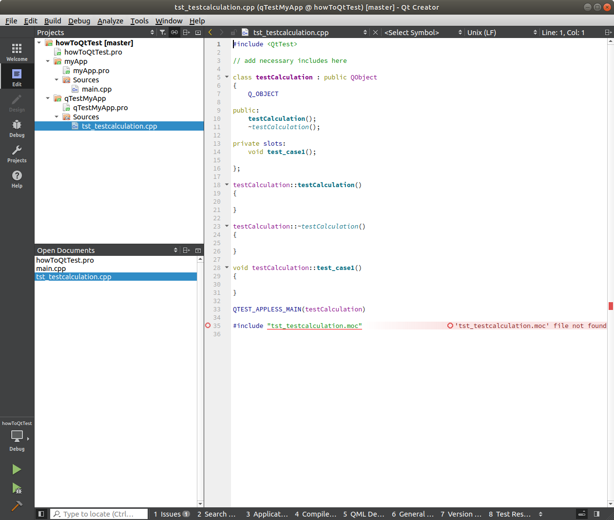

      

3. Qt Test 코드 생성

   1. 간단하게 myApp프로젝트에서 덧셈과 뺄셈 함수를 만들고 QtTest에서 이 함수를 시험하는 코드를 작성해 보겠다. myApp프로젝트에 addSub.cpp, addSub.h 파일을 생성하고 아래와 같이 간단한 코드를 삽입했다.

      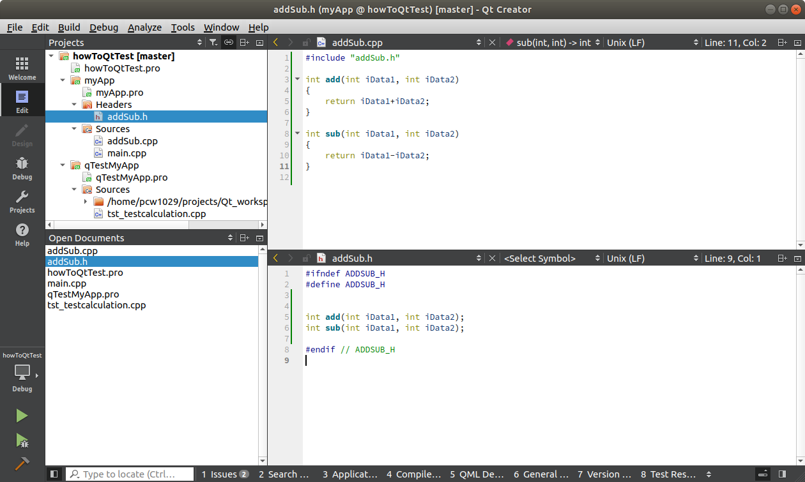

      

   2. 테스트 코드를 작성하기 위해 qTestMyApp 프로젝트로 이동하고, qTestMyApp.pro파일을 우선 열어준다.  아래와 같이 myApp/addSub.cpp 파일을 추가해주고  tst_testcalculation.cpp파일로 이동한다.

      

      

   3. 기본적으로 test_case1이란 Slot 함수가 보일것이다. 추가 테스트가 필요하면 아래와 같이 test_case2 또는 다른 이름을 사용해서 추가하면 된다.

      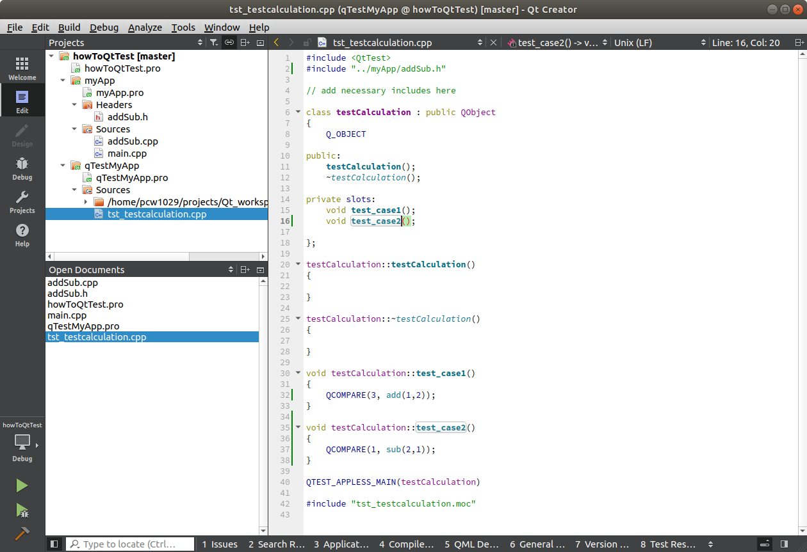

      

   4. qTestMyApp 프로젝트에서 마우스 우측버튼을 클릭하여 Run해보면 아래의 테스트 결과가 출력된다.

      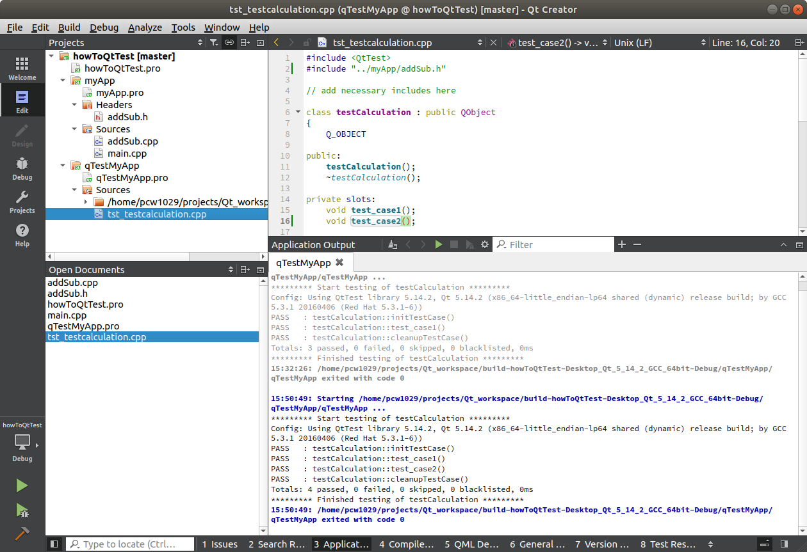
