1. Qt5 Github 원격 저장소에 연결하기 

   1. Qt에 git 명령어 위치 지정하기 

      리눅스의 경우 보통 /usr/bin에 위치해 있으며, 윈도우 사용자의 경우 경로를 찾앙보시기 바랍니다.  
      git의 설치 위치를 찾았으면 Qt Creator를 열고 Tools->Options...로 이동합니다. 

      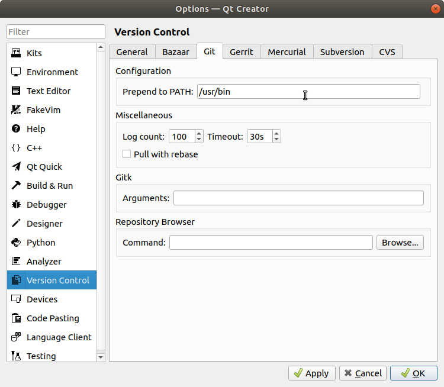

      위 그림과 같이 Options창이 출력되며 Version Control의 Git 탭에서 PATH를 입력해 줍니다.

      

2. Qt Creator에서 github로 새 프로젝트 시작하기

   1. GitHub에 원격 저장소를 생성하고, README와 .gitignore에 QT를 선택합니다.

      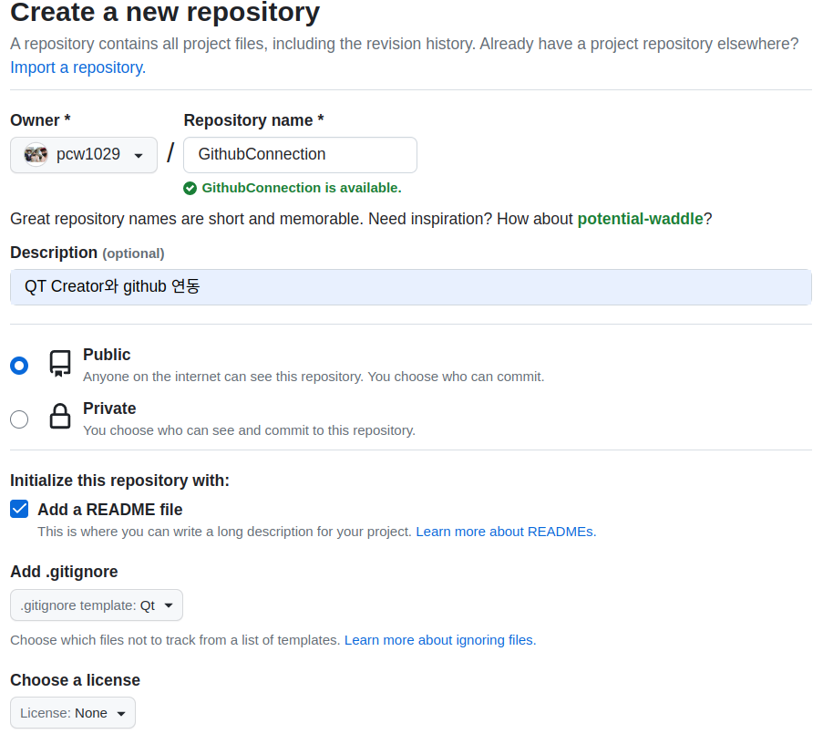

      

   2. git clone 명령을 통해 생성한 원격 저장소를 로컬 저장소로 복제합니다. 

      아래는 복제한 로컬 저장소에 QT프로젝트를 생성하는 과정이다.  

      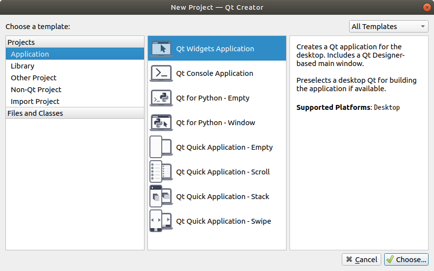

      

      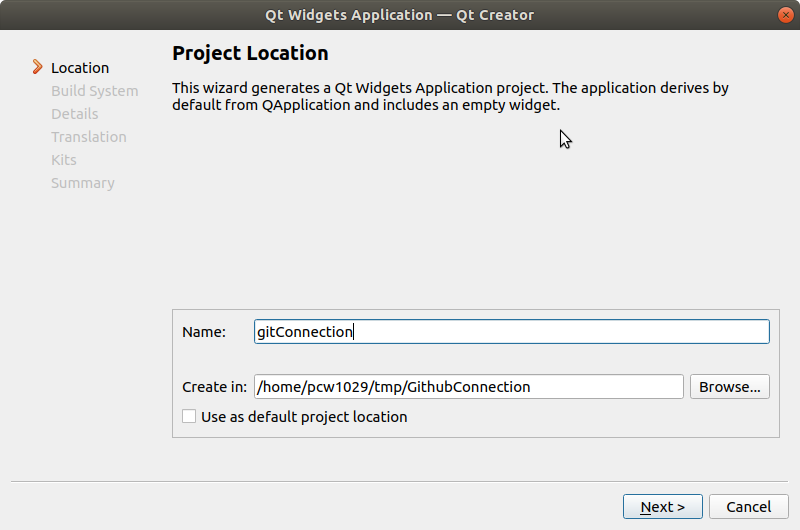

      

      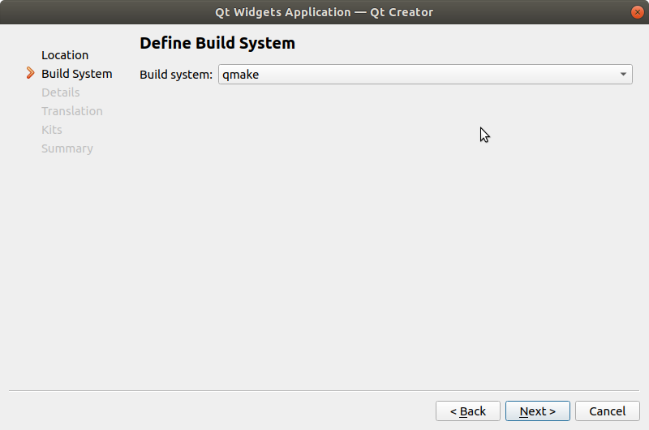

      

      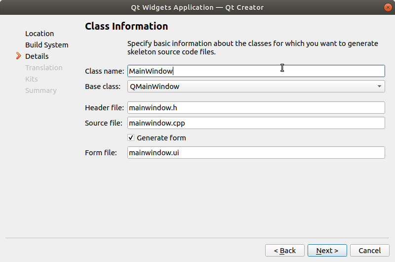

      

      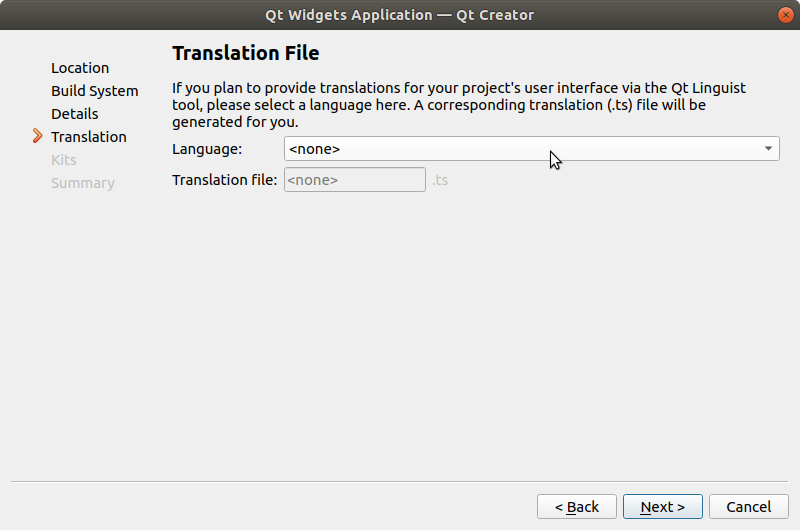

      

      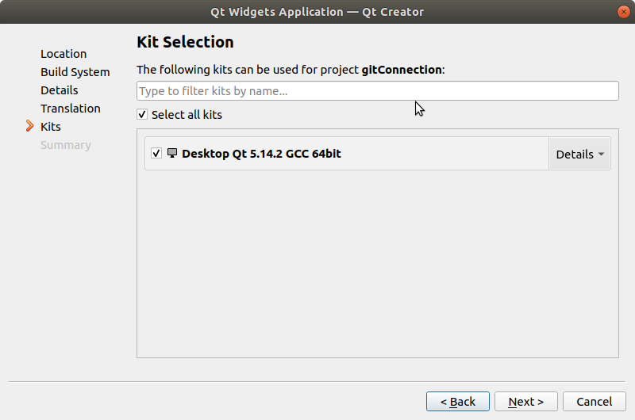

      

      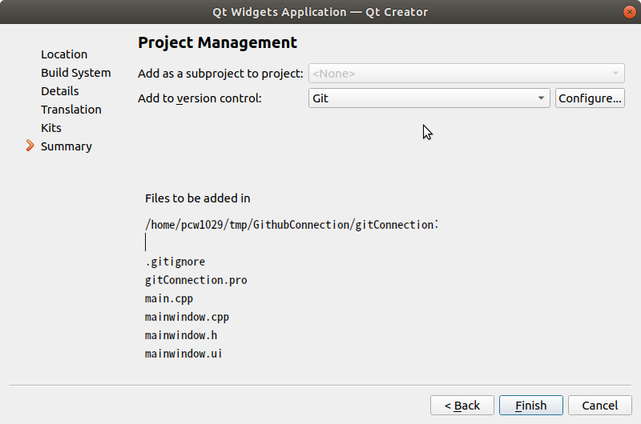

      

   3. 아래는 생성한 프로젝트를 Github 업로드하는 과정입니다.

      Tools -> Git -> Local Repository -> Commit...

      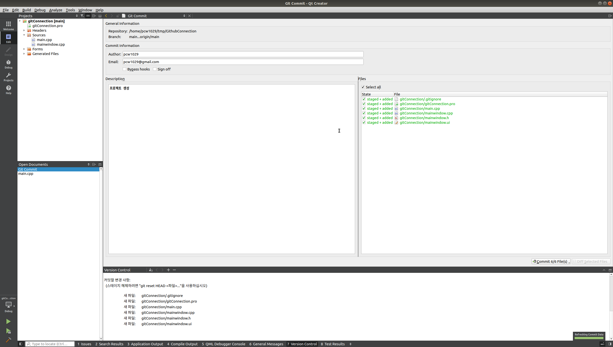

      

   4. 설명을 추가하고 Commit을 클릭합니다.

      올바르게 commit이 수행되었다면 아래 그림과 같이 Committed 6 files. 문구가 출력됩니다.

      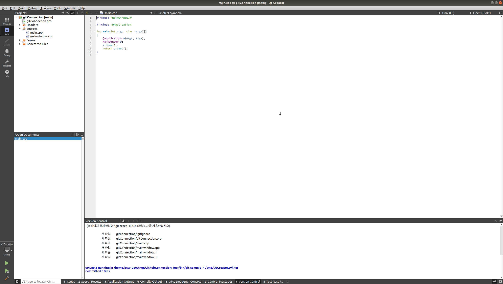

      

   5. 변경사항을 원격저장소로 올리기 위한 과정입니다.

      내 저장소의 경우 personal key를 사용하기 때문인지 QT에서 지원하는 Remote Push가 제대로 작동하지 않는다. 

      따라서 Git-gui를 사용해 push하는 방법을 알아보도록 하겠다. 

      Tools -> Git Tools -> Git Gui 위에서 Commit 과정을 Git-gui를 이용해서도 할수있다. 참고하면된다.  

      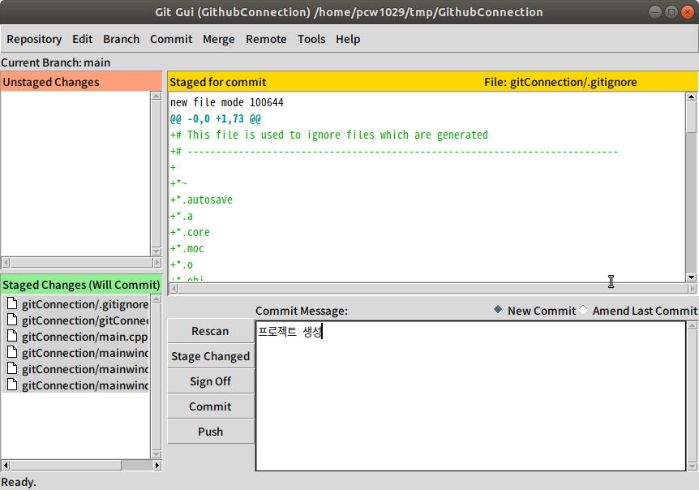

      

   6. Commit이 끝난 다음 Git-gui는 아래와 같이 나타난다.

      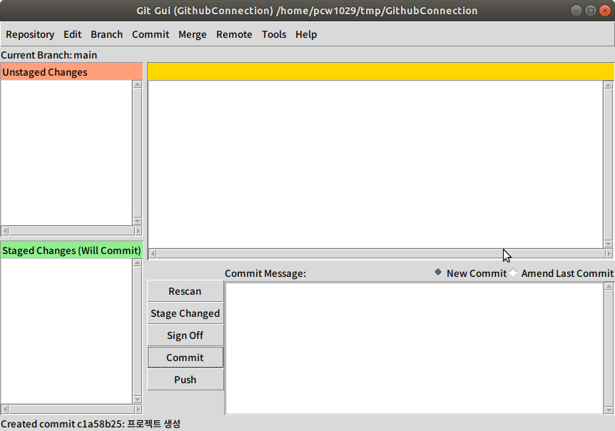

      

   7. Push를 클릭하면 새로운 창이 하나 출력된다.

      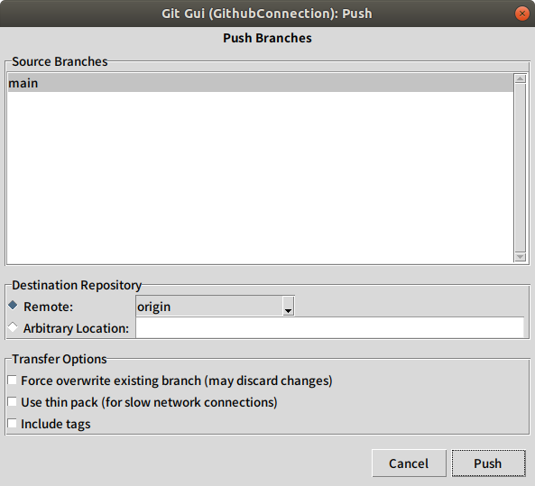

      

   8. Source Branches를 선택하고 Push를 클릭하면 사용자이름과 패스워드를 입력하라는 창이 출력되고, 패스워드에 github에 생성한 Personal Access Token Key를 입력하면된다.

      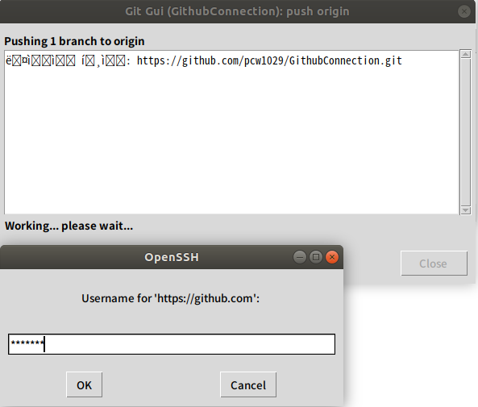

      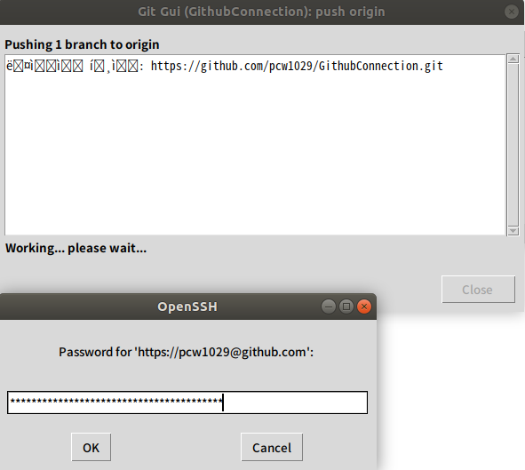

      

   9. 정상적으로 업로드된 화면이다.  Git Gui에서 한글 언어팩이 설치되어 있지 않아 이상한 기호의 글이 출력되지만 사용에 큰 영향은 없다.   
      이부분도 추후 확인해 보도록 하겠다.

      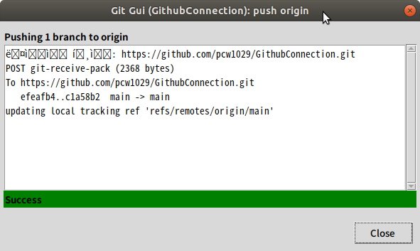

      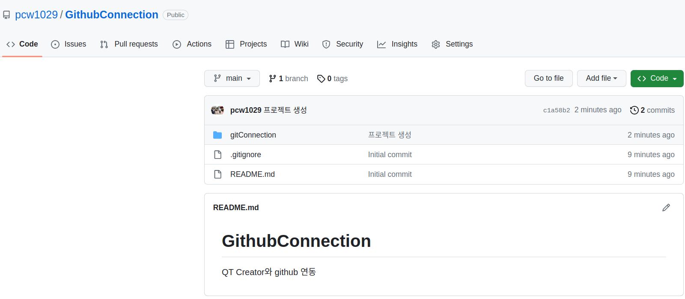

   
