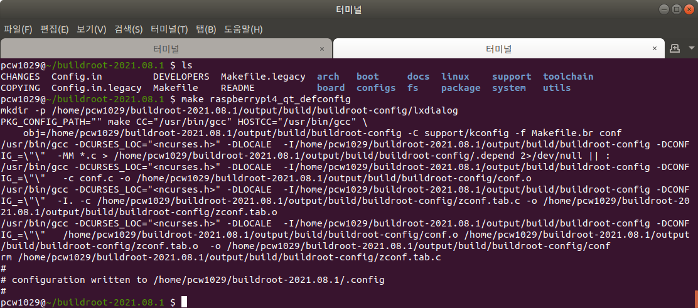
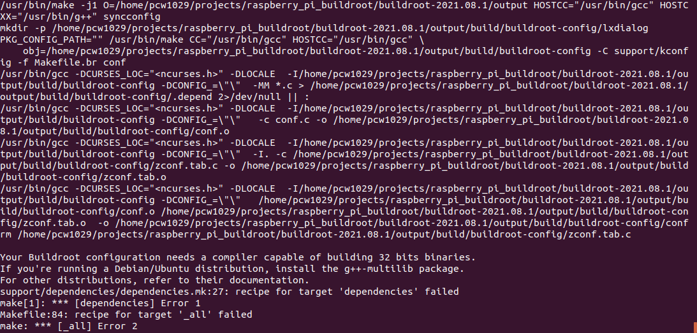
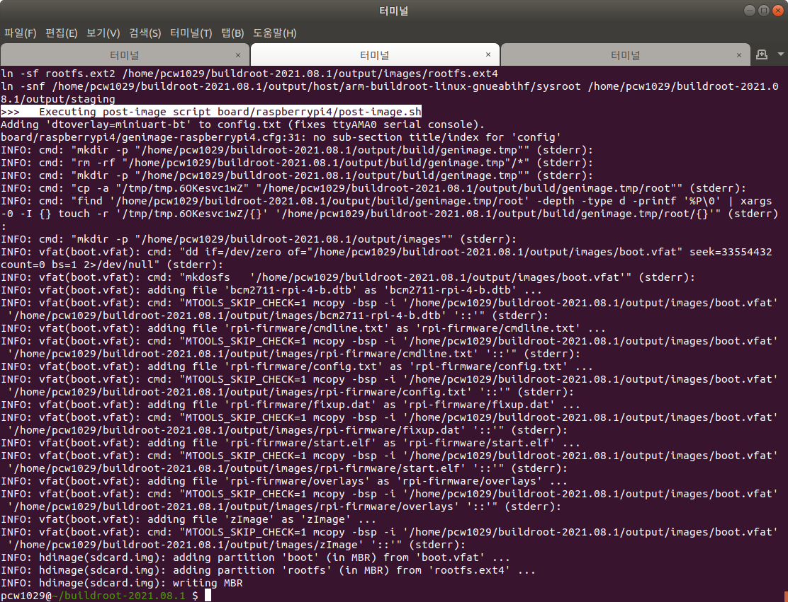
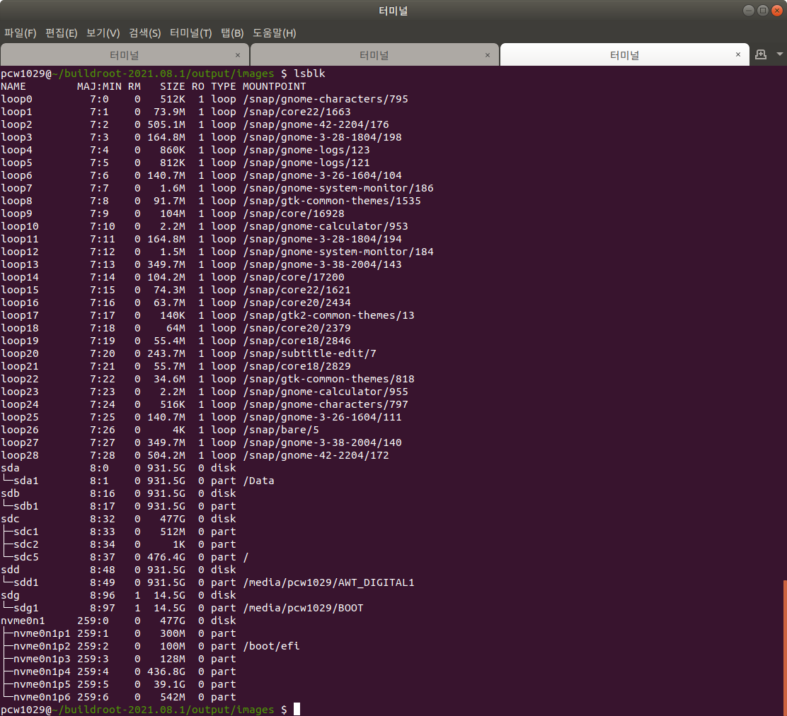
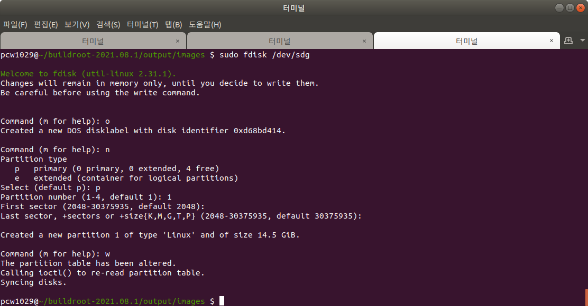

1. 개발 환경 

   Ubuntu 18.04 (Desktop)

   buildroot version : 2021.08.1

   5.5 Inch Amoled Display(1080 x 1920) 

   

2. buildroot-2021.08.1 Download site : https://buildroot.org/downloads/

   

3. QT5 Application 실행을 위한 raspberry pi4 설정 정보

   filename : raspberrypi4_qt_defconfig 

   ```defconf
   BR2_arm=y
   BR2_cortex_a72=y
   BR2_ARM_FPU_NEON_VFPV4=y
   
   BR2_TOOLCHAIN_BUILDROOT_GLIBC=y
   BR2_TOOLCHAIN_BUILDROOT_CXX=y
   
   BR2_SYSTEM_DHCP="eth0"
   
   # Linux headers same as kernel, a 5.10 series
   BR2_PACKAGE_HOST_LINUX_HEADERS_CUSTOM_5_10=y
   
   BR2_LINUX_KERNEL=y
   BR2_LINUX_KERNEL_CUSTOM_TARBALL=y
   BR2_LINUX_KERNEL_CUSTOM_TARBALL_LOCATION="$(call github,raspberrypi,linux,4afd064509b23882268922824edc5b391a1ea55d)/linux-4afd064509b23882268922824edc5b391a1ea55d.tar.gz"
   BR2_LINUX_KERNEL_DEFCONFIG="bcm2711"
   
   # Build the DTB from the kernel sources
   
   BR2_LINUX_KERNEL_DTS_SUPPORT=y
   BR2_LINUX_KERNEL_INTREE_DTS_NAME="bcm2711-rpi-4-b"
   
   BR2_LINUX_KERNEL_NEEDS_HOST_OPENSSL=y
   
   #
   # Development tools
   #
   BR2_PACKAGE_CMAKE_ARCH_SUPPORTS=y
   
   # Build Qt5 WebEngine
   BR2_PACKAGE_LIBERATION=y
   BR2_PACKAGE_QT5=y
   BR2_PACKAGE_QT5BASE_EXAMPLES=y
   BR2_PACKAGE_QT5BASE_GIF=y
   BR2_PACKAGE_QT5BASE_JPEG=y
   BR2_PACKAGE_QT5BASE_PNG=y
   
   #
   # Other GUIs
   # 
   BR2_PACKAGE_QT5BASE_GUI=y
   
   #
   # directfb backend available if directfb is enabled
   # 
   BR2_PACKAGE_QT5BASE_DEFAULT_QPA="linuxfb"
   
   #
   # Firmware
   # 
   BR2_PACKAGE_DBUS=y
   
   #
   # chipmunk needs an OpenGL backend
   # 
   BR2_PACKAGE_FONTCONFIG=y
   
   #
   # irrlicht needs X11 and an OpenGL provider
   #
   BR2_PACKAGE_JPEG=y
   BR2_PACKAGE_LIBPNG=y
   BR2_PACKAGE_EXPAT=y
   BR2_PACKAGE_ICU=y
   BR2_PACKAGE_ICU_CUSTOM_DATA_PATH=""
   BR2_PACKAGE_UTIL_LINUX_LIBUUID=y
   BR2_PACKAGE_RPI_FIRMWARE=y
   BR2_PACKAGE_RPI_FIRMWARE_VARIANT_PI4=y
   BR2_PACKAGE_RPI_USERLAND=y
   BR2_TOOLCHAIN_GLIBC_GCONV_LIBS_COPY=y
   BR2_PACKAGE_HIDAPI=y
   BR2_PACKAGE_LIBGUDEV=y
   BR2_PACKAGE_LIBHID=y
   BR2_PACKAGE_LIBUSB=y
   BR2_PACKAGE_LIBUSB_COMPAT=y
   
   # Required tools to create the SD image
   BR2_PACKAGE_HOST_DOSFSTOOLS=y
   BR2_PACKAGE_HOST_GENIMAGE=y
   BR2_PACKAGE_HOST_MTOOLS=y
   
   # Filesystem / image
   BR2_TARGET_ROOTFS_EXT2=y
   BR2_TARGET_ROOTFS_EXT2_4=y
   BR2_TARGET_ROOTFS_EXT2_SIZE="800M"
   # BR2_TARGET_ROOTFS_TAR is not set
   BR2_ROOTFS_DEVICE_CREATION_DYNAMIC_EUDEV=y
   BR2_ROOTFS_POST_BUILD_SCRIPT="board/raspberrypi4/post-build.sh"
   BR2_ROOTFS_POST_IMAGE_SCRIPT="board/raspberrypi4/post-image.sh"
   BR2_ROOTFS_POST_SCRIPT_ARGS="--add-miniuart-bt-overlay --gpu_mem_1024=200"
   ```

   buildroot-2021.08.1/configs/ 폴더로 raspberrypi4_qt_defconfig파일을 생성하고 위 내용을 입력한다. 

   

4. buildroot-2021.08.1/ 위치에서 make raspberrypi4_qt_defconfig 명령을 통해  raspberrypi4_qt_defconfig 설정을 적용한다. 

   ```bash
   pcw1029@~/buildroot-2021.08.1 $ make raspberrypi4_qt_defconfig
   ```

   

   

5. make 명령을 통해 이미지를 생성한다. 

   ```bash
   pcw1029@~/buildroot-2021.08.1 $ make
   ```

   

   1. 빌드시 아래와 같이 오류가 발생한 경우

      

      

   2. Desktop에 buildroot 컴파일시 필요한 g++-multilib 패키지가 설치되어 있지 않기 때문에 발생한 오류이다. 아래 명령을 통해 해당 오류를 해결하고 make를 다시 실행한다. 위와 같은 오류는 대부분 설정 파일이 정상인 경우 Desktop에 필요한 패키지가 설치되어 있지 않아 발생하는 경우가 대부분이다. 따라서 필요한 패키지를 설치함으로서 대부분 해결 할 수 있다. 

      ```bash
      pcw1029@~/buildroot-2021.08.1 $ sudo apt-get install g++-multilib
      pcw1029@~/buildroot-2021.08.1 $ make
      ```

      

      

6. raspberry pi4용 SD카드 만들기

   1. SD카드를 Desktop에 삽입하고 아래 명령을 통해 현재 블록 장치(HDD, SSD, USB등) 연결 정보를 확인한다.

      ```bash
      pcw1029@~/buildroot-2021.08.1/output/images $ lsblk
      ```

      

      

   2. SD카드의 파티션을 해제한다. 

      ```bash
      pcw1029@~/buildroot-2021.08.1/output/images $ sudo umount /dev/sdg*
      ```

      

   3. SD카드 파티션 테이블을 생성한다.

      ```bash
      pcw1029@~/buildroot-2021.08.1/output/images $ sudo fdisk /dev/sdg
      ```

      

      1. 기존 파티션 테이블을 삭제하고 새로운 파티션 테이블 만듭니다.

         ```
         Command (m for help): o
         ```

         

      2. 새파티션을 생성합니다.

         ```
         Command (m for help): n
         ```

         

      3. 주파티션을 선택합니다.

         ```
         Select (default p): p
         ```

         

      4. 첫번째 파티션으로 설정합니다.

         ```
         Partition number (1-4, default 1): 1
         ```

         

      5. 이후 Enter을 키를 눌러 기본 설정 한다.

         ```
         First sector (2048-30375935, default 2048): 
         Last sector, +sectors or +size{K,M,G,T,P} (2048-30375935, default 30375935): 
         ```

         

      6. 변경 사항을 저장하고 fdisk를 종료한다.

         ```
         Command (m for help): w
         ```

      

      

   4. FAT32파일 시스템으로 포멧한다.

      ```bash
      pcw1029@~/buildroot-2021.08.1/output/images $ sudo mkfs.vfat /dev/sdg1
      ```

      

   5. 이미지를 SD카드에 복사한다.

      ```bash
      pcw1029@~/buildroot-2021.08.1/output/images $ sudo dd bs=4M if=./sdcard.img of=/dev/sdg status=progress conv=fsync
      ```

      

   6. SD카드를 안전하게 제거하기 위해 아래 명령을 실행 후 SD카드를 분리한다. 

      ```bash
      pcw1029@~/buildroot-2021.08.1/output/images $ sudo sync
      pcw1029@~/buildroot-2021.08.1/output/images $ sudo eject /dev/sdX
      ```

      

7. AMOLED Display를 위한 config.txt 파일 수정

   1. 기존 config.txt파일에서 아래 내용을 추가한다. 

      ```bash
      pcw1029@~/buildroot-2021.08.1/output/images $ gedit rpi-firmware/config.txt
      ```

      ```
      enable_uart=1
      
      # Run as fast as firmware / board allows
      arm_boost=1
      
      disable_splash=1
      dtoverlay=disable-bt
      boot_delay=0
      
      max_framebuffer_width=1080
      max_framebuffer_height=1920
      hdmi_force_hotplug=1
      display_rotate=1
      config_hdmi_boost=7
      hdmi_group=2
      hdmi_mode=87
      hdmi_drive=2
      hdmi_timings=1080 1 26 4 50 1920 1 8 2 6 0 0 0 60 0 135580000 30
      ```

      

   2. AMOLED Display 관련 자료 정보는 아래 사이트를 참고

      https://www.waveshare.com/wiki/5.5inch_HDMI_AMOLED

   

8. 부팅시 로고 삽입

   1. 김프 이미지 편집 툴을 이용하여 로고로 사용할 이미지를 생성한다. 

   2. 부팅 로고로 사용하기 위해 ppm파일로 변경한다.

      convert your_image.png -resize 224x224 -colors 224 logo_linux_clut224_binary.ppm

   3. binaray인 경우 ascii로 변경해준다.

      pnmnoraw logo_linux_clut224_binary.ppm > logo_linux_clut224_ascii.ppm

   4. 해당 경로로 이미지를 복사한 다음  커널을 재 컴파일 한다.

      cp logo_linux_clut224_ascii.ppm ~/buildroot-2021.08.1/output/build/linux-custom/drivers/video/logo/logo_linux_clut224.ppm

   5. 커널의 로그 레벨에 따라 로고가 출력 안될수도 있다. 따라서 로그레벨에 따라 영향 받지 않게 하기 위해 ~/buildroot-2021.08.1/output/build/linux-custom/drivers/video/fbdev/core/fbcon.c 파일을 수정해 준다.

      ```c
      if (logo_shown < 0 && console_loglevel <= CONSOLE_LOGLEVEL_QUIET) 	
          logo_shown = FBCON_LOGO_DONTSHOW;
      ```

      위 코드 삭제 또는 주석 처리한다. 

      

   6. ㅇ

9. d
