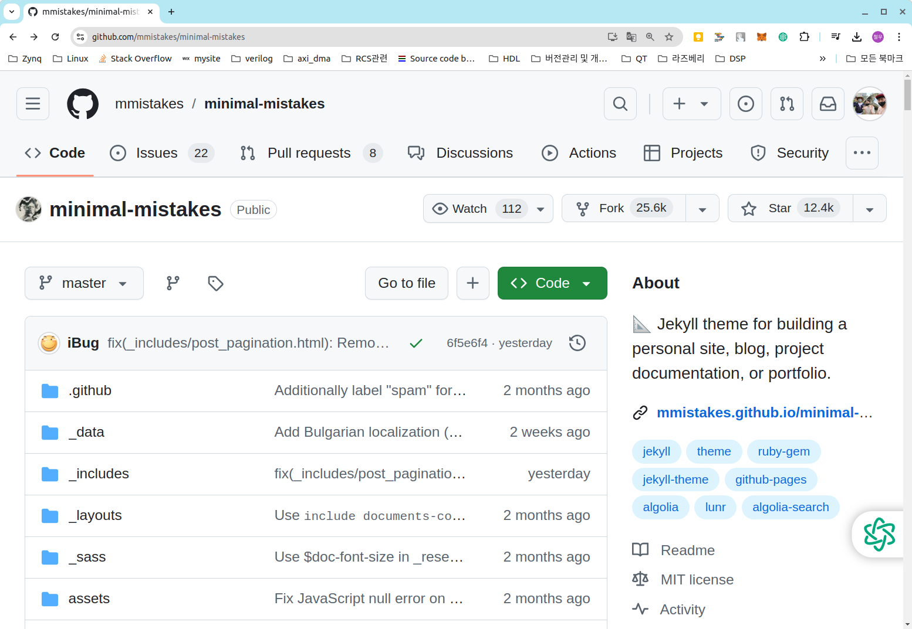
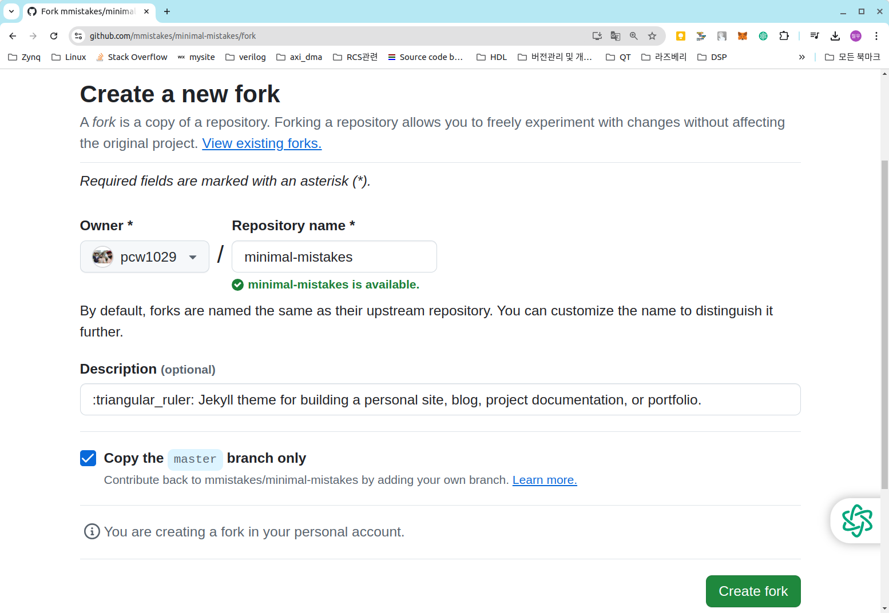
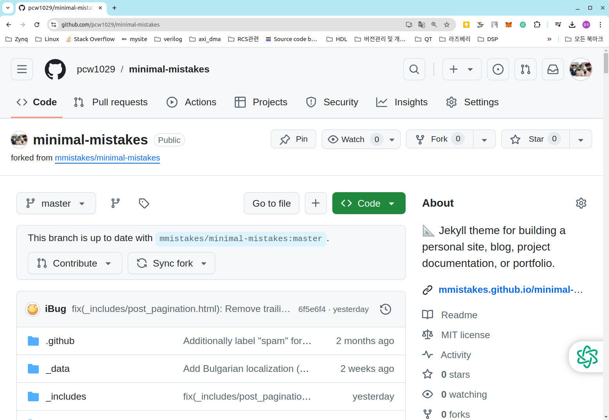
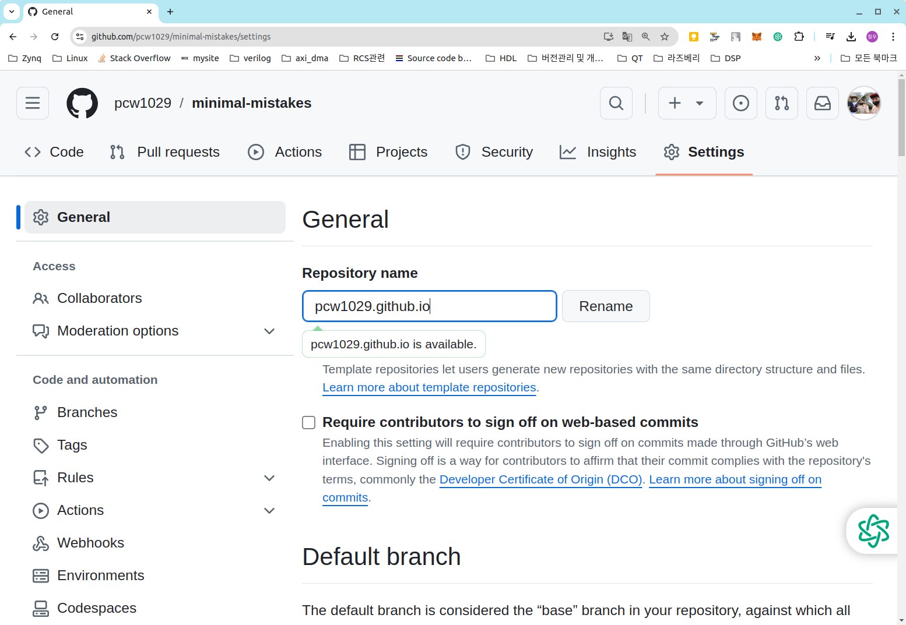
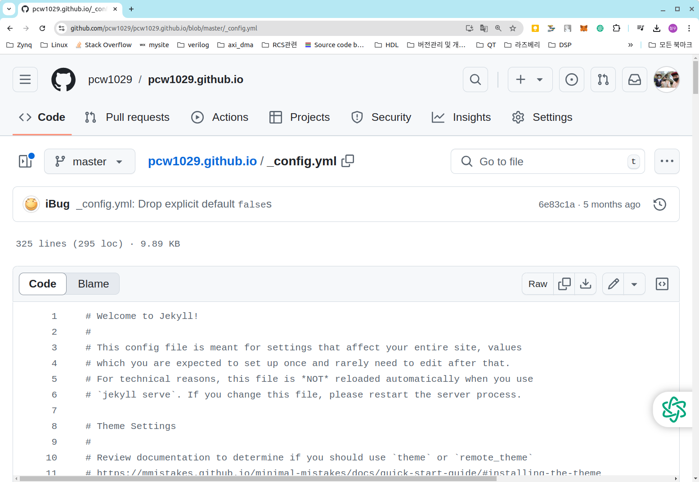
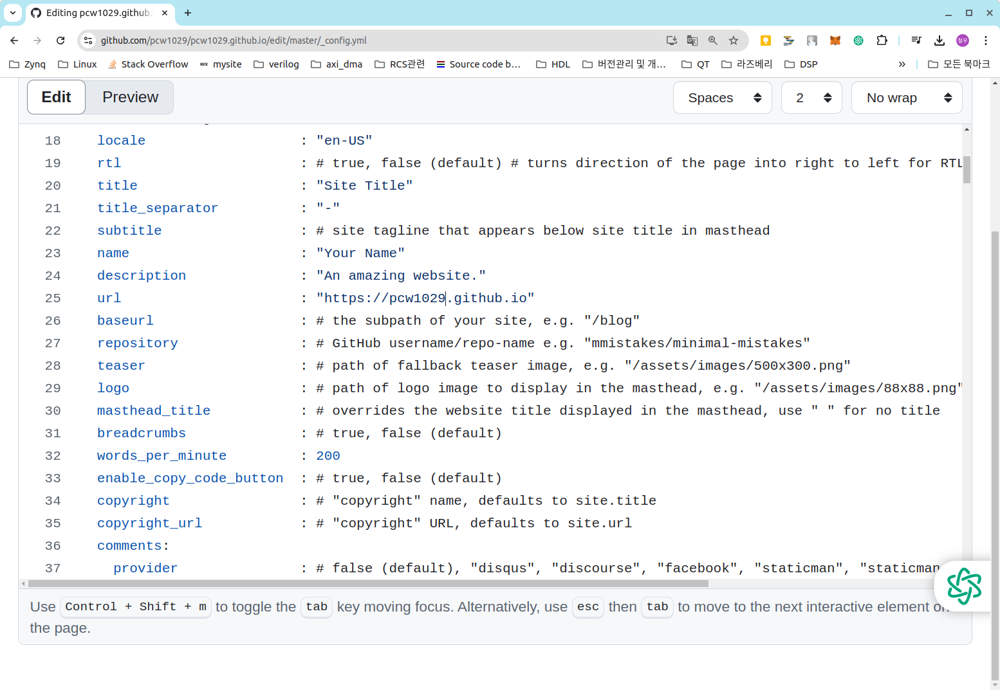
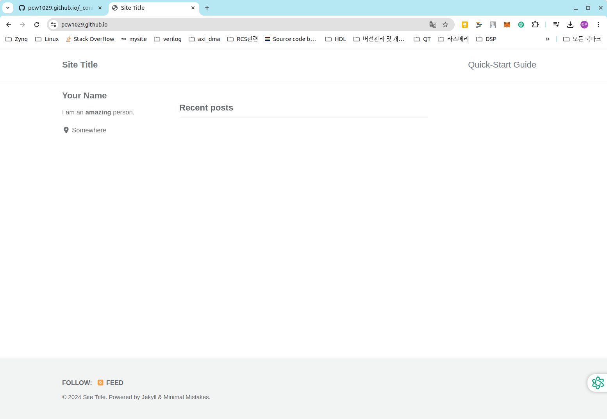

1. https://github.com/topics/jekyll-theme 이곳에서 원하는 테마(minimal-mistakes)를 선택한다. 

   

   

2. 우측 상단의 Fork 클릭 하게 되면 minimal-mistakes의 전체 블로그 코드를 나의 github 계정 으로 복사하게 된다.

   

   

3. Create fork를 클릭하면 내 Github 계정에 minimal-mistakes가 생성된 것을 확인 할 수 있다.

   

   

4. Settings에 들어가서 **Repository name**을 반드시 내 아이디**.github.io**로 설정해야 한다.

   

   

5. 블로그의 환경 설정 관련 파일인 _config.yml 파일을 클릭해서 몇가지 수정해 주겠다. _config.yml클릭하면 연필 모양을 볼 수 있는데 연필 모양을 클릭하여 Edit 모드로  url을 내 Github 블로그로 수정해 준다.

   

   

6. url 수정 전 

   url   : # the base hostname & protocol for your site e.g. "[https://mmistakes.github.io](https://mmistakes.github.io/)"

   url 수정 후 

   url   : "https://pcw1029.github.io"

   

   

7. Commit changes...을 클릭하여 수정 내용을 적용한다. 이제 인터넷 주소 창에 pcw1029.github.io를 입력하면 나만의 블로그 확인 할 수 있다. 

   

   
