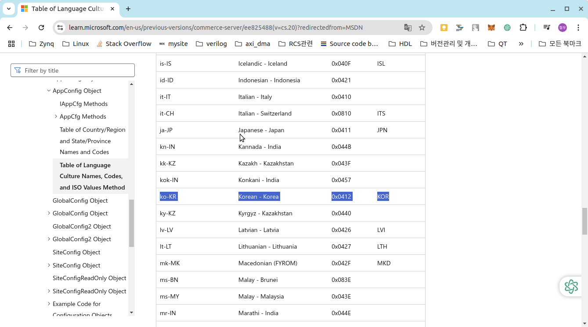

# 구성

블로그 전체에 영향을 미치는 설정은 JekyII의 구성파일(_config.yml)에서 변경 할 수 있으며 아래 사이트를 참고 하세요.

참고 사이트 : https://mmistakes.github.io/minimal-mistakes/docs/configuration/

여기서 간단히 설정 변경을 해보겠다. 


## Skin 변경

블러그 설정을 위해 _config.yml을 minimal_mistakes_skin을 수정하여 적용한다.

스킨은 https://github.com/mmistakes/minimal-mistakes 사이트에서 참고하여 선택한다. 

```yaml
# remote_theme           : "mmistakes/minimal-mistakes"
minimal_mistakes_skin    : "default" # "air", "aqua", "contrast", "dark", "dirt", "neon", "mint", "plum", "sunrise"

# Site Settings
```


수정 후 

```yaml

# remote_theme           : "mmistakes/minimal-mistakes"
minimal_mistakes_skin    : "dark" # "air", "aqua", "contrast", "dark", "dirt", "neon", "mint", "plum", "sunrise"

# Site Settings
```


## Site locale 변경

https://learn.microsoft.com/en-us/previous-versions/commerce-server/ee825488(v=cs.20)?redirectedfrom=MSDN 사이트를 참고하여 선택한다.



```yaml
# Site Settings
locale                   : "en-US"
rtl                      : # true, false (default) # turns direction of the page into right to left for RTL languages
```

수정 후

```yaml
# Site Settings
locale                   : "ko-KR"
rtl                      : # true, false (default) # turns direction of the page into right to left for RTL languages
```

이런식으로 참고 사이트 : https://mmistakes.github.io/minimal-mistakes/docs/configuration/ 를 참고하여 설정을 변경하면 된다.
